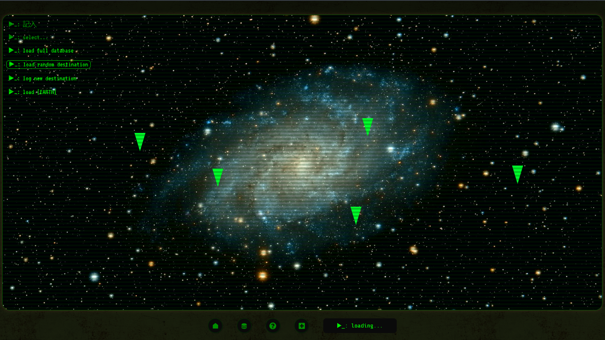
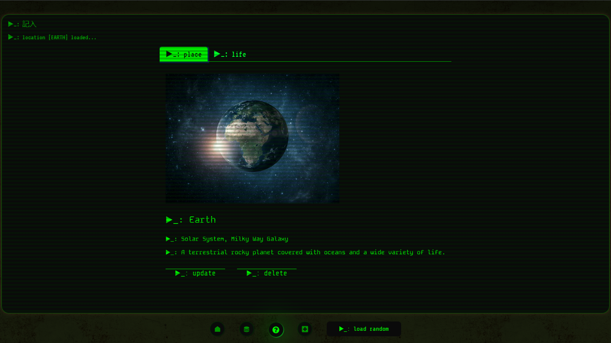

# Exo App: Cosmic Logger
[Try it here!](https://project-exo-app.netlify.app/)
 
 
by [Alfonso Marquez](https://github.com/mqzmcs) and [Yavuz Balay](https://github.com/yvzbly)
 

Description below

# [2024 APR] Version 2 redesigned and updated by [Alfonso Marquez](https://github.com/mqzmcs)
(2024 March 27)
<blockquote>
As of April 2024, and with Yavuz's consent, I have re-designed and implemented sweeping changes to Exo App: Cosmic Logger, and it is now on version 2. The original/initial codebase (version 1) is archived in the branch <i>v01-archive</i> in the same repo. Version 2 is being staged in the branch <i>alfonso</i> of the same repo, from where it is being pushed to master. -- Alfonso
</blockquote>
 

Updates and changes

- Removed:
    - Initial-load Star Wars-style scrolling text modal/popup + film music
        - Rationale:
            <blockquote>
                Although a fun and cool addition, the copyrighted Star Wars song used in order to mimic the films' intro was removed as the app is no longer seen as strictly a school project. In addition, the modal made less aesthetic sense, not fitting the current artistic direction, which is meant to evoke a dystopian post-apocalyptic computer interface. -- Alfonso
            </blockquote>
    - Earth display modals/popup on homepage
        - Rationale:
            <blockquote>
                Fed into the modal/popup was simply the URL to the Earth page, consequently rendering another copy of the Earth page inside the popup, potentially allowing for infinitely opening the page within the page. While now increasingly fixable as we continue to grow in our abilities, the modal/popup doesn't fit the updated aesthetic. -- Alfonso
            </blockquote>
    - Typing and submission sound effects on the edit/update and add location pages
        - Rationale:
            <blockquote>
                This is something that can certainly be implemented again. For brevity and organizational purposes, it has been removed. -- Alfonso
            </blockquote>

- Changes:
    - Version 1 was previously named <i>Cosmic Logger: Bootcamp Wars</i>.
    - CSS tags renamed, reworked and consolidated ref. D.R.Y. principles.
    - Previously, 2-3 massive .css files contained all the CSS code -- now, where applicable and logical, each page and/or component has its own corresponding .css file to handle specificities.
    - Layout, interface, colour scheme and font style reworked and redesigned to evoke something similar to the [Pip-Boy wearable computer from Bethesda's Fallout video game franchise](https://en.wikipedia.org/wiki/Pip-Boy).
    - <b>Responsive design:</b> version 2 has been redesigned and restructured beginning with a 375px (iPhone SE) viewport width in mind.

- Other:
    - Copyrighted material removed (intro music, homepage background image).
    - Externally sourced media with available attribution logged below.
    - The database is non-persistent and submitted images are fetched in real-time via URL and are not saved, stored or duplicated locally or on a server.

- Note:
    - [Yavuz Balay](https://github.com/yvzbly) programmed and implemented the bulk of the modal/popup code, the typing and submission audio effects, and the auto-scrolling Star Wars text and music. While these have unfortunately been removed, as stated above, the code is still preserved in the originally deployed version 1 of the app archived in the [v01-archive sub-branch of the same repo](https://github.com/m02p02/react-json-project02/tree/v01-archive/src).
    - The remainder of the collaborated codebase is regularly being refactored.

## Description

This app began as a unit project during Ironhack's Web Development Bootcamp to exercise and showcase React.js + CRUD (create, read, update, delete) functionality.

It momentarily employs a non-persistent JSON API database in which users are able to submit, read, edit and remove entries, details and images of a fictional or non-fictional location and its life forms.

The concept of the cosmetic design and interactivity is meant to evoke a sense of sci-fi nostalgia and distopian grungy hacker tropes: Star Wars meets The Matrix meets Cyberpunk 2077 meets Fallout.

#### This web app features:
- JavaScript
- HTML
- CSS (vanilla) + React-Bootstrap
- React.js
- Node.js
- JSON API
- CRUD functionality

## Attribution
- CRT-style horizontal bars adapted from [DEV: Retro CRT terminal screen in CSS + JS, by Edwin](https://dev.to/ekeijl/retro-crt-terminal-screen-in-css-js-4afh)
- Homepage galaxy photo by <a href="https://unsplash.com/@gferla?utm_content=creditCopyText&utm_medium=referral&utm_source=unsplash">Guillermo Ferla</a> on <a href="https://unsplash.com/photos/galaxy-at-night-kEEl9csCutg?utm_content=creditCopyText&utm_medium=referral&utm_source=unsplash">Unsplash</a>
- Grungy app interface background photo by <a href="https://unsplash.com/@anniespratt?utm_content=creditCopyText&utm_medium=referral&utm_source=unsplash">Annie Spratt</a> on <a href="https://unsplash.com/photos/a-black-and-white-photo-of-a-wall-UR2DMIFuc5c?utm_content=creditCopyText&utm_medium=referral&utm_source=unsplash">Unsplash</a>