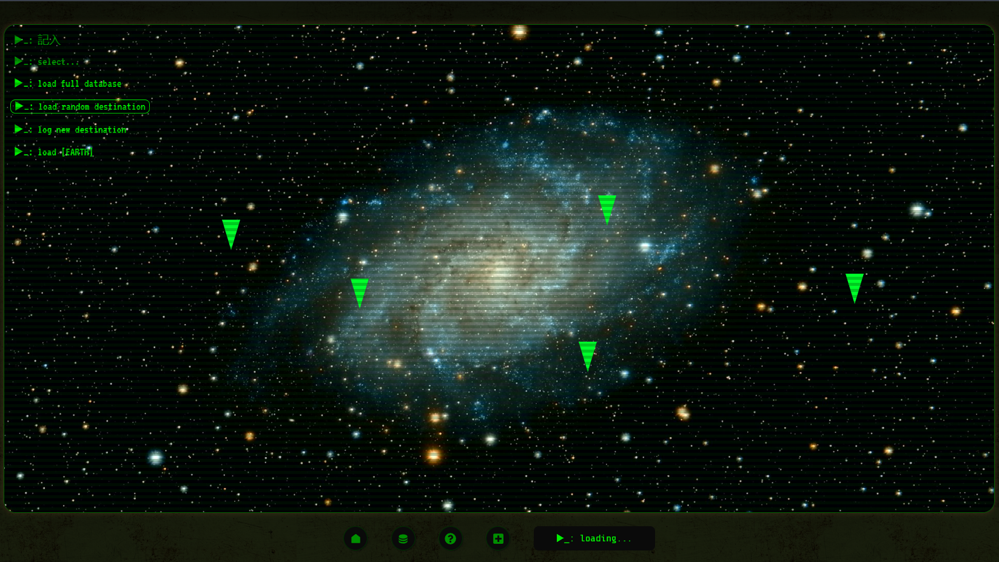
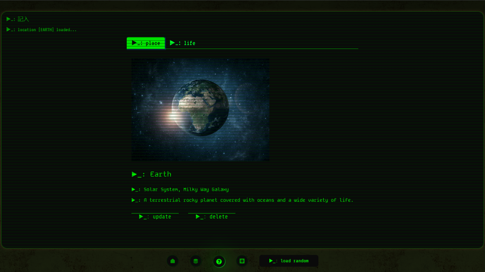

# Exo App: Cosmic Logger
[Try it here!](https://project-exo-app.netlify.app/)
 
 
by [Alfonso Marquez](https://github.com/mqzmcs) and [Yavuz Balay](https://github.com/yvzbly)
 

Description below

# [2024 APR] Version 2 redesigned and updated by [Alfonso Marquez](https://github.com/mqzmcs)
(2024 March 27)
<blockquote>
As of April 2024, and with Yavuz's consent, I have made sweeping changes to Exo App: Cosmic Logger, and it is now on version 2. The original/initial codebase (version 1) is archived in the branch <i>bubblemaster</i> of the same repo. Version 2 is being staged in the branch <i>alfonso</i> of the same repo. -- Alfonso
</blockquote>
 

Updates and changes

- Removed:
    - Initial-load Star Wars-style scrolling text modal + music
        - Rationale:
            <blockquote>
                The copyrighted Star Wars song used in order to mimic the films' intro was removed as the app is no longer seen as strictly a school project. Consequently, the modal made much less sense artistically and dramatically. In addition, the modal does not fit the current artistic direction, which is meant to evoke a dystopian post-apocalyptic computer interface.
            </blockquote>
    - Earth display modals/popup on homepage

- Changed:
    - Version 1 was named <i>Cosmic Logger: Bootcamp Wars</i>
    - CSS tags renamed, reworked and consolidated ref. D.R.Y. principles
    - Previously, 2-3 massive .css files contained all the CSS code -- now, where applicable and logical, each page and/or component has its own corresponding .css file to handle specificities
    - Layout, interface, colour scheme and font style reworked and redesigned to evoke something similar to the [Pip-Boy wearable computer from Bethesda's Fallout video game franchise](https://en.wikipedia.org/wiki/Pip-Boy)
    - <b>Responsive design:</b> version 2 has been redesigned and restructured beginning with a 375px (iPhone SE) viewport width in mind

- Other:
    - Copyrighted material removed (intro music, homepage background image)
    - Externally sourced media with available attribution logged below
    - The database is non-persistent and submitted images are fetched in real-time via URL and are not saved, stored or duplicated locally or on a server

## Description

This app began as a unit project during Ironhack's Web Development Bootcamp to exercise and showcase React.js + CRUD (create, read, update, delete) functionality.

It momentarily employs a non-persistent JSON API database in which users are able to submit, read, edit and remove entries, details and images of a fictional or non-fictional location and its life forms.

The concept of the cosmetic design and interactivity is meant to evoke a sense of sci-fi nostalgia and distopian grungy hacker tropes: Star Wars meets The Matrix meets Cyberpunk 2077 meets Fallout.

#### This web app features:
- JavaScript
- HTML
- CSS (vanilla) + React-Bootstrap
- React.js
- Node.js
- JSON API
- CRUD functionality

## Run the app:
1. ``[optional]`` Give your browser permission to autoplay sounds.

2. [Go to the live app deployed and hosted on Netlify](https://project-exo-app.netlify.app/)

3. ~~``[optional]`` To reload the sequence that executes only upon first visiting the app's URL, ``clear the site's browser data`` (cookies, storage, cache).~~

## Attribution
- CRT-style horizontal bars adapted from [DEV: Retro CRT terminal screen in CSS + JS, by Edwin](https://dev.to/ekeijl/retro-crt-terminal-screen-in-css-js-4afh)
- Homepage galaxy photo by <a href="https://unsplash.com/@gferla?utm_content=creditCopyText&utm_medium=referral&utm_source=unsplash">Guillermo Ferla</a> on <a href="https://unsplash.com/photos/galaxy-at-night-kEEl9csCutg?utm_content=creditCopyText&utm_medium=referral&utm_source=unsplash">Unsplash</a>